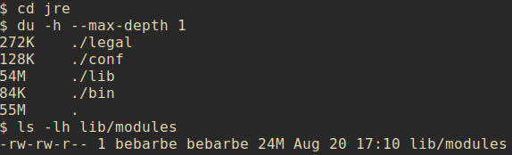
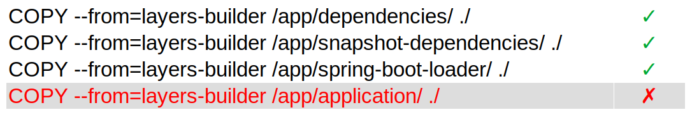

= Optimiser les images docker avec JLink et les layers
// :revealjs_customtheme: https://raw.githubusercontent.com/joshed-io/revealjs-themes/refs/heads/master/css/theme/robot-lung.css

== Généralités et rappels

=== JDK vs JRE vs JVM
image::img/JDK-JVM-JRE-Diagram.png[]

=== Les modules du JRE

Historiquement, les librairies étaient packagées dans `lib/rt.jar`.

Depuis https://www.oracle.com/fr/corporate/features/understanding-java-9-modules.html[Java 9 et l'apparition des modules], les librairies sont encapsulées dans un fichier `lib/modules`

=== Dockerfile avec JRE

Sur une application Spring Boot / Spring Cloud, l'image docker devient facilement lourde alors que l'application n'utilise qu'une petite partie des modules du JRE.

== Jdeps et JLink

=== Utilisation de Jdeps

https://docs.oracle.com/en/java/javase/21/docs/specs/man/jdeps.html[Jdeps] permet de lister les modules d'un jar.

Pour lister les modules des dépendances (par exemple, mon projet utilise Hibernate, je veux savoir quels modules utilise Hibernate), il est nécessaire d'extraire le jar à analyser et passer son dossier lib (contenant les jar des dépendances) en paramètre.

[source, bash]
----
$ jdeps \
--ignore-missing-deps \
--print-module-deps \
-q \
--recursive \
--multi-release 17 \
--class-path="/app/unpacked/BOOT-INF/lib/*" \
--module-path="/app/unpacked/BOOT-INF/lib/*" \
/app/app.jar > /app/dependencies.info

$ cat /app/dependencies.info
$ java.base,java.compiler,java.desktop,java.instrument,java.net.http,java.prefs,java.rmi,java.scripting,java.security.sasl,java.sql.rowset,jdk.jfr,jdk.management,jdk.net,jdk.security.jgss,jdk.unsupported
----

=== Utilisation de Jlink

https://docs.oracle.com/en/java/javase/11/tools/jlink.html[Jlink] permet de créer un runtime custom, à partir des modules et dépendances précis.

[source, bash]
----
jlink --verbose \
--compress 2 \
--strip-java-debug-attributes \
--no-header-files \
--no-man-pages \
--output /jre \
--add-modules $(cat /app/dependencies.info)
----

On peut jouer sur le niveau de compression des ressources, les symboles de debug dans les .class, ... mais surtout, les modules java à inclure dans notre JRE custom.

=== Utilisation de Jlink

Le poids total de ce JRE est bien plus faible, les modules embarqués ont été diminués.

=== Intégration dans un Dockerfile
Pour intégrer le JRE dans l'image docker, on utilise Dockerfile multi stage : plusieurs `FROM`

On initialise un stage _builder_ :

[source, dockerfile]
----
FROM alpine:3.20.3

RUN apk add --no-cache openjdk17-jdk
----

=== Intégration dans un Dockerfile
On ajoute Jdeps :

[source, dockerfile]
----
COPY ./target/*.jar /app/app.jar

RUN mkdir /app/unpacked && \
    unzip /app/app.jar -d /app/unpacked && \
    jdeps \
    --ignore-missing-deps \
    -q \
    --recursive \
    --multi-release 17 \
    --print-module-deps \
    --class-path="/app/unpacked/BOOT-INF/lib/*" \
    /app/app.jar > /app/dependencies.info && \
    rm -rf /app/unpacked
----

=== Intégration dans un Dockerfile
On génère notre jre custom :

[source, dockerfile]
----
RUN jlink --verbose \
    --compress 2 \
    --strip-java-debug-attributes \
    --no-header-files \
    --no-man-pages \
    --output /jre \
    --add-modules $(cat /app/dependencies.info)
----

=== Intégration dans un Dockerfile
Stage applicatif, utilisant les fichiers du stage `builder` :

[source, dockerfile]
----
FROM alpine:3.20.3

ENV JAVA_HOME=/jre
ENV PATH="${JAVA_HOME}/bin:${PATH}"

COPY ./target/*.jar /app/app.jar

RUN addgroup -g 1000 -S hello && \
    adduser -u 1000 -G hello -D hello && \
    chown -R hello /app

COPY --from=builder /jre $JAVA_HOME

USER hello

WORKDIR /app

EXPOSE 8080

CMD java -Djava.security.egd=file:/dev/./urandom -jar /app/app.jar
----

=== Intégration dans un Dockerfile
Résultat, image bien plus légère.

[%step]
image::https://media1.tenor.com/m/bHIe_ab5YQMAAAAd/woohoo-homer-simpson.gif[woohoo,height=200]

== Layers
=== Layer Docker
* Un layer est une commande modifiant le FS de l'image
* Un layer est mis en cache, en local et sur le registry. Si une image utilise un même layer, il ne sera pas rebuildé
* Les layers suivants dépendent des layers précédents
* Si un layer est invalidé, il est rebuildé
* Si un layer est invalidé, les layers suivants le sont aussi

=== Layer Docker

[.columns]
=== Layer Docker

[.column.is-two-thirds]
--
Dans un build multi stage, les layers sont indépendants d'un stage à l'autre.

--

[.column]
--
[%step]
image::https://media1.tenor.com/m/mX58EIkHyskAAAAd/jenga-fail.gif[jenga,height=200,align="center"]
--

=== Layer Docker
* Dans un registry, en réalité, on ne pousse pas une image docker entière, mais seulement ses layers.
* Une image est un ensemble de layers.
* Des images peuvent partager des mêmes layers.

=== Layer Spring

https://docs.spring.io/spring-boot/maven-plugin/packaging.html#packaging.layers[Spring Boot propose ses layers] pour être compatible avec Docker.

Toutes les classes et dépendances applicatives (application + dépendances tierces + spring) sont réparties dans plusieurs layers, tous référencés dans un fichier `layers.idx` du jar/war, chargé au lancement de l'application.

[source, bash]
----
$ java -Djarmode=layertools -jar app.jar list

dependencies
spring-boot-loader
snapshot-dependencies
application
----

Ces répertoires contenant les .class sont visibles directement dans le jar/war, dans le répertoire `BOOT-INF`

=== Layer Spring

Les layers peuvent être extraits du jar

[source, bash]
----
$ java -Djarmode=layertools -jar app.jar extract
$ ls

dependencies/
spring-boot-loader/
snapshot-dependencies/
application/
----

=== Intégration des layers Spring dans des layers Docker

Une fois les layers extraits du binaires, on peut les inclures dans le Dockerfile

[source, dockerfile]
----
### builder stage ###
FROM alpine:3.20.3 AS builder
#...
RUN cd /app && \
    java -Djarmode=layertools -jar app.jar extract
### app stage ###
FROM alpine:3.20.3
#...
COPY --from=builder /jre $JAVA_HOME
COPY --from=builder /app/dependencies/ /app/
COPY --from=builder /app/snapshot-dependencies/ /app/
COPY --from=builder /app/spring-boot-loader/ /app/
COPY --from=builder /app/application/ /app/

USER hello

WORKDIR /app

EXPOSE 8080

ENTRYPOINT ["java", "org.springframework.boot.loader.launch.JarLauncher"]
----

=== Intégration des layers Spring dans des layers Docker

Les dépendances ne changent pas, le code de l'application change.

Seulement le layer applicatif est rebuildé et re poussé sur le registry.

=== Intégration des layers Spring dans des layers Docker

Lors du build, les layers de dépendances sont bien cachées. Uniquement le layer applicatif et les suivants sont rebuildés.
[source, bash]
----
$ docker build -t hello-world -f Dockerfile-jlink-jdeps-layers .

[...]
=> CACHED [stage-1 3/8] COPY --from=builder /jre /jre
=> CACHED [stage-1 4/8] COPY --from=builder /app/dependencies/ /app/
=> CACHED [stage-1 5/8] COPY --from=builder /app/snapshot-dependencies/ /app/
=> CACHED [stage-1 6/8] COPY --from=builder /app/spring-boot-loader/ /app/
=> [stage-1 7/8] COPY --from=builder /app/application/ /app/
[...]
----

=== Intégration des layers Spring dans des layers Docker

En inspectant la dernière image docker, on constate bien que uniquement le layer, de 927kB, contenant les sources a été recréé.

[source, bash]
----
$ docker history b91f8acb7300
----

=== Intégration des layers Spring dans des layers Docker

Lors du push, uniquement le layer contenant les sources est envoyé sur le registry

=== Intégration des layers Spring dans des layers Docker

En inspectant l'image, on constate que le poids n'a pas bougé.
L'empreinte totale reste la même, la différence est que les images docker suivantes réutiliseront le même layer contenant les dépendances, pour une meilleure utilisation globale de l'espace disponible sur le registry.

== Garbage Collector

=== Impact de l'utilisation de layers

Sur la machine de build, Docker utilise du stockage pour son cache de build :

* Les layers y sont stockés (qu'ils soient sur des stages intermédiaires ou finaux)
* Le build est KO si le cache est plein

[%step]
--
Deux solutions :

* `cron` avec un  `docker builder prune` : pas optimal, supprime tout le cache
* https://docs.docker.com/build/cache/garbage-collection/[Garbage Collector] : supprimer intelligemment les layers moins utilisés
--

=== Mise en place

Nécessite d'utiliser Buildkit comme backend : par défaut depuis Docker 23
[source, yaml]
----
{
  ...
  "builder":
    {
      "gc":
        {
          "enabled": true,
          "defaultKeepStorage": "20GB",
          "policy":
            [
              { "keepStorage": "20GB", "filter": ["unused-for=168h"] },
              { "keepStorage": "30GB", "filter": ["unused-for=72h"] },
              { "keepStorage": "40GB", "filter": ["unused-for=24h"] },
              { "keepStorage": "50GB", "filter": ["unused-for=12h"] },
              { "keepStorage": "60GB", "all": true },
            ],
        },
    },
}
----

== Réflection

Si le JRE custom créé par Jdeps et Jlink ne contient que les modules utilisés par l'applicaiton, quid de ceux appelés par réflection ?

=== Test blanc

Cas d'utilisation simple, du `HttpClient`, appartenant au module `java.net.http` :

[source, java]
----
HttpClient client = HttpClient.newHttpClient();

HttpRequest request = HttpRequest.newBuilder()
        .uri(new URI("https://postman-echo.com/get"))
        .GET()
        .build();

HttpResponse<String> response = client.send(request, HttpResponse.BodyHandlers.ofString());

System.out.println("response = " + response.body());
----

Jdeps détecte bien le module :
----
java.base,java.net.http
----

Lors du lancement, le JRE créé par Jlink fonctionne très bien :
----
response = {
  "args": {},
  "headers": {
    "host": "postman-echo.com",
    "x-request-start": "t1733479815.018",
    "connection": "close",
    "x-forwarded-proto": "https",
    "x-forwarded-port": "443",
    "x-amzn-trace-id": "Root=1-6752cd87-12aedaff052000e13ab6c01b",
    "user-agent": "Java-http-client/17.0.6"
  },
  "url": "https://postman-echo.com/get"
}
----

=== Version reflection

Le code est migré (en partie) vers de la réflection : pas d'`import` explicique de `java.net.http` :
[source, java]
----
Object httpClient = Class.forName("java.net.http.HttpClient")
        .getDeclaredMethod("newHttpClient")
        .invoke(null);

Class<?> uriClazz = Class.forName("java.net.URI");
Constructor<?> uriConstructor = uriClazz.getConstructor(String.class);
Object uri = uriConstructor.newInstance("https://postman-echo.com/get");

Object request = Class.forName("java.net.http.HttpRequest")
        .getDeclaredMethod("newBuilder")
        .invoke(null);

request = request.getClass()
        .getDeclaredMethod("uri", Class.forName("java.net.URI"))
        .invoke(request, uri);

// ...
----

Donc Jdeps ne détecte pas le module :
----
java.base
----

Inévitablement, l'application avec son JRE custom ne fonctionne pas !
----
Exception in thread "main" java.lang.RuntimeException: java.lang.ClassNotFoundException: java.net.http.HttpClient
	at com.benjamin_barbe.App.main(App.java:50)
Caused by: java.lang.ClassNotFoundException: java.net.http.HttpClient
	at java.base/jdk.internal.loader.BuiltinClassLoader.loadClass(Unknown Source)
	at java.base/jdk.internal.loader.ClassLoaders$AppClassLoader.loadClass(Unknown Source)
	at java.base/java.lang.ClassLoader.loadClass(Unknown Source)
	at java.base/java.lang.Class.forName0(Native Method)
	at java.base/java.lang.Class.forName(Unknown Source)
	at com.benjamin_barbe.App.main(App.java:23)
----

== Conclusion

Pour optimiser nos images docker, plusieurs axes :

[%step]
* Jdeps et Jlink pour utiliser un JRE custom : réduire la taille des images
* Utiliser les layers : ne réduit pas la taille des images, mais privilégie la réutilisation et le rebuild "intelligent"

[%step]
Impacts :

[%step]
* L'empreinte des images docker sera considérablement réduite
* Le stockage utilisé sur la machine de build sera considérablement augmenté

[%step]
Il faut utiliser le garbage collector !

== Merci !
